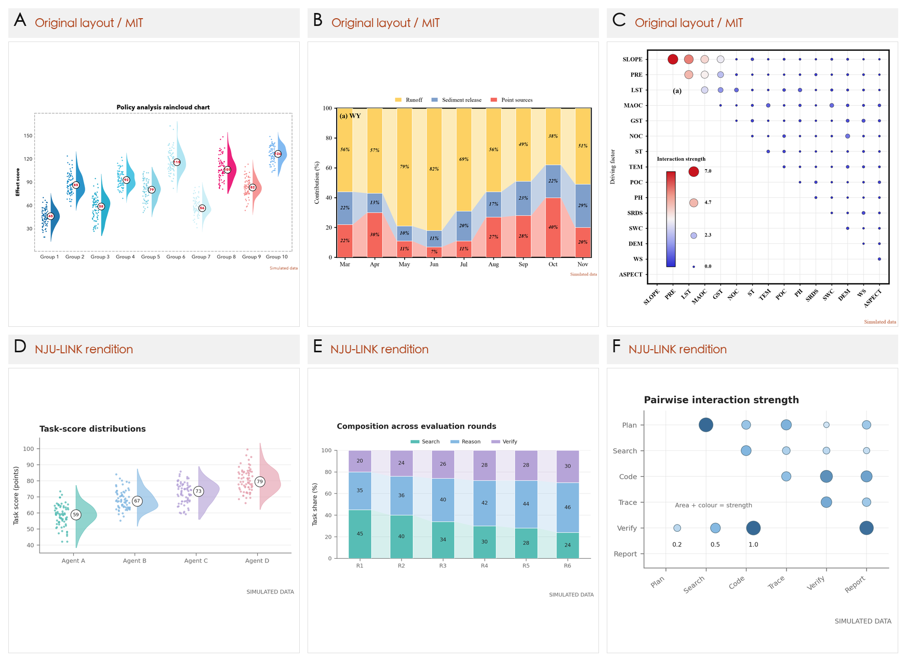
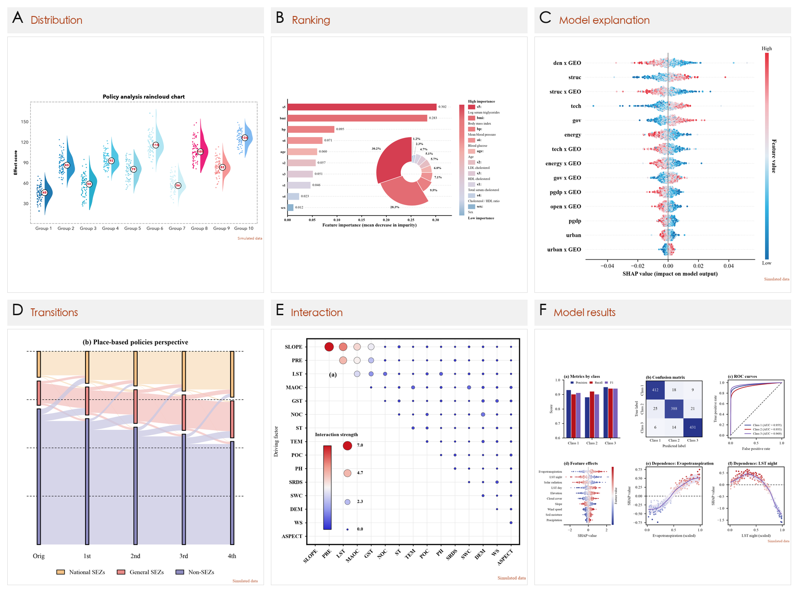

# NJU-LINK Figure Style × Plot Is All You Need

把 NJU-LINK 科研图的视觉语法与 [Plot Is All You Need](https://github.com/liouhai/plot-is-all-you-need) 的看图选图工作流整合为一个 skill：**挑参考 → 组合布局与配色 → 用自己的数据重画 → 并排验收**。仍通过 `$njulink-figure-style` 调用。

## 先看整合后的效果

上排是上游 MIT 自产示例，下排是本项目的 NJU-LINK 改绘：保留雨云图、百分比连接带、上三角气泡矩阵的结构，使用统一的字体、pastel 类别色和连续强度色。

这些图使用不同的模拟数据，展示结构和视觉部件的迁移，不表示相同实验结果，也不宣称像素级复刻。三张改绘的 [代码](scripts/gallery_examples.py) 可生成 PNG、PDF、SVG；需要贴近一比一时按指定参考图测量布局、字体与色值。

## T2AV-Compass 的精髓图参考

你指出的 T2AV-Compass 主图确实应该作为显式参考入口。下面三张图直接从 NJU-LINK 官方仓库的固定 commit 加载，方便在 GitHub 上查看 radial comparison、prompt pipeline、六面板 radar 和层级 sunburst。原图仍由官方项目托管；本仓库只记录链接、版本和哈希，没有把未声明统一许可的原始二进制复制进来。完整说明见 [T2AV-Compass 参考锚点](references/t2av-compass.md)。

  

<em>主图：放射状模型比较 + 分布/条形统计 + 多层 sunburst。它是这套 skill 里“总览—证据—层级”组合的首要参考。</em>

  

<em>流程图：大虚线容器、浅色圆角阶段、短标签和模态色。</em>

  

<em>比较图：用 small multiples 保持多维评测可读，跨面板复用颜色语义。</em>

需要离线查看上述同一版本时运行：

~~~bash
python scripts/fetch_t2av_references.py
~~~

下载内容会进入 Git 忽略的 `reference-cache/t2av-compass/`，脚本会逐个校验 SHA-256。公开可分发的独立重绘示例在 [t2av-compass-style-demo.png](examples/t2av-compass-style-demo.png)，生成代码在 [t2av_style_demo.py](scripts/t2av_style_demo.py)；它使用合成数据和自造标签，不复制 T2AV 原图。

上图把 T2AV 的三段证据关系压缩成一张可运行示例：左侧 radial，中部分布与横向条，右侧三层 sunburst。它是结构迁移示例，不代表 T2AV 的实验结果。

## 这次整合了什么

| 能力 | 入口 |
|---|---|
| 原有流程图、radar、bar、heatmap 与 NJU-LINK token | [绘图原语](scripts/njulink_style.py)、[视觉语法](references/figure-grammar.md) |
| 14 套上游自产模板，原图 + 卡片 + Python，1 套另附 CSV | [可浏览图库索引](gallery/INDEX.md) |
| 3 张使用 NJU-LINK token 的改绘例子 | [生成脚本](scripts/gallery_examples.py) |
| 按数据选图、“A 的布局 + B 的配色”、六部件拆解 | [参考工作流](references/gallery-workflow.md) |
| 候选样板册、成品对照、配色卡 | [contact_sheet.py](scripts/contact_sheet.py) |
| 本地图库入库、重复检查、索引重建 | [ingest.py](scripts/ingest.py)、[build_index.py](scripts/build_index.py) |
| T2AV-Compass 官方锚点、离线抓取与独立重绘 | [参考文档](references/t2av-compass.md)、[fetch_t2av_references.py](scripts/fetch_t2av_references.py)、[t2av_style_demo.py](scripts/t2av_style_demo.py) |

原有风格预设是默认值；用户指定的参考和部件组合优先。上游样例仍保留各自原配色，不能把整个新图库都称为 NJU-LINK 原有风格。

## 图库预览

下图展示 14 套上游模板中的 6 套。点击 [索引](gallery/INDEX.md) 可查看全部 **17 张**图片和卡片，再按卡片里的代码生成。

14 套上游模板包含雨云/小提琴、分组堆叠柱、百分比连接带、冲积流图、气泡矩阵、排序柱与玫瑰环、SHAP 蜂群、依赖图、预测值对照、模型结果面板等。上游 13 套使用模拟数据；排序玫瑰环据上游说明采用公开 diabetes 数据集导出的特征重要性，仓库未重新训练该模型。

## 直接这样调用

> `$njulink-figure-style` 用我的 CSV 比较四个 agent 的逐任务得分。参考图库里的雨云图布局，使用 NJU-LINK 配色，保留每个样本和中位数，直接给成品及参考对照。

> `$njulink-figure-style` 给我几种适合这份错误分析数据的草图，让我看图选。确认数据是否支持转移流图；如果只有阶段占比，就不要画成个体流向。

> `$njulink-figure-style` 按这张参考图尽量一比一重画，替换为我的数据。测量面板比例、间距、字体和颜色，交付可运行脚本、矢量图、并排对照及未匹配细节。

> `$njulink-figure-style` 将这张图加入我的本地图库，保留来源并写鉴赏卡片；不要改公开图库。

## 安装与复现

将仓库放到 skills 目录，环境依赖建议装进虚拟环境：

~~~bash
git clone https://github.com/bupterlxp/njulink-figure-style-skill.git ~/.codex/skills/njulink-figure-style
cd ~/.codex/skills/njulink-figure-style
python3 -m venv .venv
.venv/bin/python -m pip install -r requirements.txt
~~~

已有目录时更新现有仓库即可。以下命令从仓库根目录运行：

~~~bash
# 原有综合示例
.venv/bin/python scripts/demo.py --output-dir figures/base

# 三张 NJU-LINK 改绘：PNG / PDF / SVG
.venv/bin/python scripts/gallery_examples.py --output-dir figures/njulink

# T2AV-Compass 视觉结构独立重绘：PNG / PDF
.venv/bin/python scripts/t2av_style_demo.py --output-dir figures/t2av

# 上游模板：复制代码/CSV 到工作目录，并输出 PNG / PDF / SVG
.venv/bin/python scripts/render_gallery.py raincloud-median-badges --out figures/reference

# 制作选图样板册、参考与成品对照、配色卡
.venv/bin/python scripts/contact_sheet.py sheet --out figures/options.png raincloud-median-badges njulink-raincloud
.venv/bin/python scripts/contact_sheet.py compare --out figures/compare.png --labels "上游参考,NJU-LINK 改绘" raincloud-median-badges njulink-raincloud
.venv/bin/python scripts/contact_sheet.py swatches --out figures/palette.png njulink-raincloud

# 用户图默认进入被 Git 忽略的 gallery-local/
.venv/bin/python scripts/ingest.py /path/to/figure.png --source "我的参考图"
.venv/bin/python scripts/build_index.py
~~~

render_gallery.py 只执行本库已审读的模板，输出已存在时要求另选目录。上游模板的数据数组与标签需要按脚本注释替换；这不是对任意 CSV 的自动推断接口。图的 KDE、归一化、堆叠合计与色条含义由 skill 在实际任务中核验。

## 原有综合示例

由 [demo.py](scripts/demo.py) 生成，所有数值为合成值。可从 [njulink_style.py](scripts/njulink_style.py) 导入 apply_style、draw_pipeline、radar、pastel_bars、heatmap、save_figure。

## 来源与范围

NJU-LINK 视觉观察基于截至 2026-10-06 个人主页列出的 9 篇 Jiaming Wang 合著论文及公开项目交叉核验；主页精选集不等于所有公开论文，详见 [论文语料表](references/paper-corpus.md)。

上游固定到 [70898b8](https://github.com/liouhai/plot-is-all-you-need/tree/70898b877dc2455704070e4542db1939ff7d9ec0)。本库引入其 14 套自产示例及图库工具，保留 **Copyright (c) 2026 qc** 和 [MIT 原文](licenses/plot-is-all-you-need-MIT.txt)；上游收集的论文截图明确不属其 MIT 授权，未一并复制。完整列表、变更与文件哈希见 [整合记录](references/upstream-integration.md) 和 [manifest](references/upstream-manifest.json)。

本地 gallery-local/、taste.md、figures/、虚拟环境均被 Git 忽略。相似布局只提醒，完全相同像素才自动跳过；用户编辑过的卡片受保护。

## 验证

~~~bash
.venv/bin/python -m unittest discover -s tests -v
.venv/bin/python -m compileall -q scripts gallery
~~~

入库测试覆盖重复、同名冲突、私有图不改公开卡片及 edited 卡片保护。图库模板可通过 render_gallery.py 逐一复现；代码能运行后仍需查看实际 PNG 和目标尺寸下的文字。
