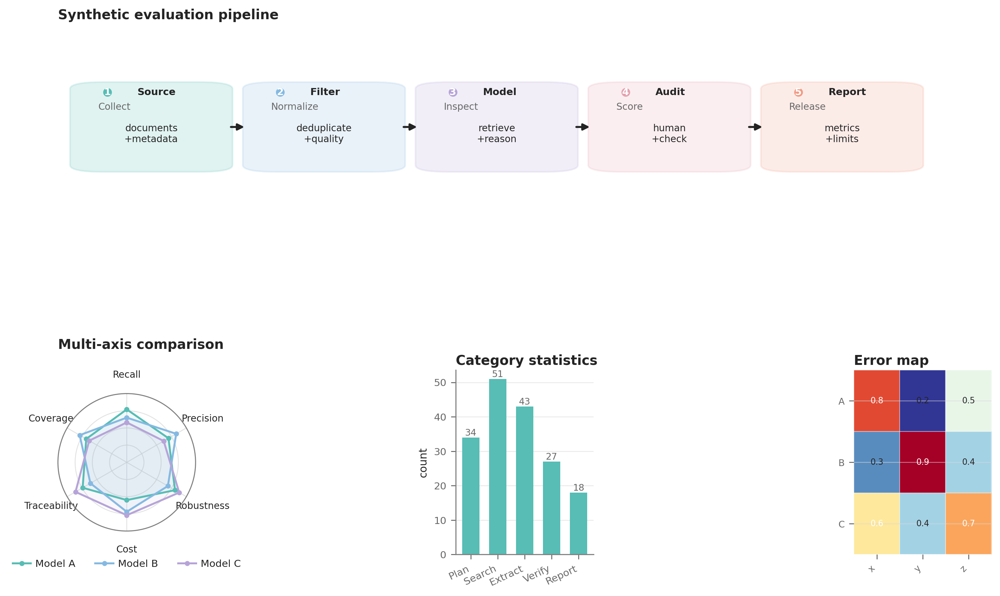

# NJU-LINK Figure Style

这是一个 Codex skill，用于按公开 NJU-LINK / Jiaming Wang 论文中可观察到的视觉语法，重画或新建科研图表。它把白底、低饱和 pastel、圆角模块、细箭头、编号阶段、radar、heatmap 和统计面板整理成可复现的 Matplotlib 工具链。

## 覆盖范围

语料快照为 2026-10-06，基于 Jiaming Wang 个人主页列出的 9 篇论文，以及 NJU-LINK 的公开项目仓库交叉核验。详细来源和证据边界见 [`references/paper-corpus.md`](references/paper-corpus.md)；抽象后的布局、颜色、线型和字体规则见 [`references/figure-grammar.md`](references/figure-grammar.md)。

这里描述的是共同作者论文语料的可观察视觉语法，不把图表归因成某位作者的个人签名，也不分发原论文图片、数据、文字或项目 logo。

## 使用

把本目录放入 Codex 的 skills 目录后，可用 `$njulink-figure-style` 调用。绘图脚本只依赖 NumPy 和 Matplotlib：

```bash
PYTHONPATH=scripts python scripts/demo.py --output-dir ./demo-output
```

`demo.py` 使用合成数据生成 PNG 与 PDF，作为工具链 smoke test。新图可从 `scripts/njulink_style.py` 导入 `apply_style`、`draw_pipeline`、`radar`、`pastel_bars`、`heatmap` 和 `save_figure`。

## 最终效果预览

运行 demo 后会得到下面这张综合示例图。它把模块化流程、模型能力 radar、统计柱图和错误 heatmap 放在同一套视觉 token 下；所有标签与数值都是合成内容，仅用于展示版式和绘图 API。



对应的矢量版由同一脚本输出为 `njulink-style-demo.pdf`。把仓库作为 skill 使用时，建议先打开这张图确认风格，再替换成自己的数据。

## 最小例子

### 1. 画一个五阶段流程图

下面的例子只使用抽象标签和合成内容，适合先确认布局、颜色和导出链路：

```bash
PYTHONPATH=scripts python - <<'PY'
from pathlib import Path
import matplotlib.pyplot as plt

from njulink_style import apply_style, draw_pipeline, save_figure

apply_style()
fig, ax = plt.subplots(figsize=(7.0, 1.9))
draw_pipeline(ax, [
    {"label": "Input", "title": "Collect", "body": "data\n+metadata"},
    {"label": "Filter", "title": "Clean", "body": "deduplicate\n+validate"},
    {"label": "Model", "title": "Infer", "body": "retrieve\n+reason"},
    {"label": "Audit", "title": "Check", "body": "human\n+metrics"},
    {"label": "Output", "title": "Report", "body": "result\n+limits"},
], width=0.15, gap=0.035)
save_figure(fig, Path("demo-output") / "pipeline")
plt.close(fig)
PY
```

它会生成 `demo-output/pipeline.png` 和 `demo-output/pipeline.pdf`。换成自己的数据前，先保持每个阶段只有一个动作和一到两行说明。

### 2. 画模型能力 radar

下面代码假定从仓库根目录运行，并设置 PYTHONPATH=scripts：

```python
import matplotlib.pyplot as plt
from njulink_style import apply_style, radar, save_figure

apply_style()
fig, ax = plt.subplots(figsize=(3.4, 3.2), subplot_kw={"projection": "polar"})
radar(
    ax,
    ["Recall", "Precision", "Robustness", "Cost", "Coverage"],
    {"Model A": [0.78, 0.72, 0.81, 0.55, 0.68],
     "Model B": [0.67, 0.83, 0.70, 0.71, 0.79]},
)
save_figure(fig, "demo-output/radar")
plt.close(fig)
```

radar 的数值应先归一化到同一范围；模型超过 5–6 个时，改用小 multiples 或分组 bar，避免彩色线条互相遮挡。

### 3. 用 Codex 生成一张错误分析图

可以直接这样描述需求：

> `$njulink-figure-style` 把我的 agent 错误统计做成一张三面板图：左侧按阶段的流程，中间是模型 radar，右侧是错误类型 heatmap。使用我提供的 CSV 数据，保持类别颜色跨面板一致，导出 300 dpi PNG 和 PDF，并给出图注与 QA 差异清单。

完整的综合示例见 [`scripts/demo.py`](scripts/demo.py)；它同时演示流程图、radar、pastel bar 和 heatmap，数据全部为虚构值。

## 目录

- `SKILL.md`：触发条件、四种工作模式和复核清单。
- `references/`：论文语料索引与视觉 grammar。
- `scripts/njulink_style.py`：可复用绘图原语。
- `scripts/demo.py`：合成数据示例。
- `assets/`：Matplotlib 风格文件和 palette JSON。
- `examples/`：README 中展示的合成结果图。

复刻参考图时，保留布局和信息层级的抽象规律，使用用户拥有的数据或合成数据，并在图注中记录来源。
