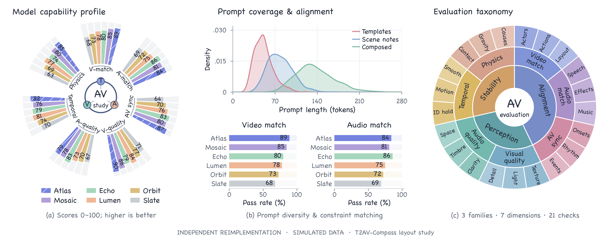

# T2AV-Compass 参考锚点

T2AV-Compass 是 NJU-LINK / Jiaming Wang 公开语料里最适合做“精髓图”参考的项目之一。它把多模态评测结果编辑成一张可读的视觉叙事：中心 radial comparison 负责总览，旁边用分布与横向条形图解释统计，最后用多层 sunburst 交代任务层级。下面固定到官方仓库 commit `7575ae07cf969c3f5d439644ecb9979862370523`，便于以后复查同一版本。

## 官方图：只作为外部参考

这些图通过官方仓库的 raw URL 加载，方便在 GitHub 页面直接看原始细节。本 skill 不把原始二进制复制进公开仓库：该项目在这个 commit 没有声明统一的图片再分发许可证。需要离线阅读时，运行 [fetch_t2av_references.py](../scripts/fetch_t2av_references.py)，文件会进入被 Git 忽略的 `reference-cache/t2av-compass/`，并按清单校验 SHA-256。

### 主图：radial + distribution + hierarchical sunburst


[打开官方原图](https://github.com/NJU-LINK/T2AV-Compass/blob/7575ae07cf969c3f5d439644ecb9979862370523/docs/static/images/main_00.jpg) · [raw](https://raw.githubusercontent.com/NJU-LINK/T2AV-Compass/7575ae07cf969c3f5d439644ecb9979862370523/docs/static/images/main_00.jpg)

观察重点：中心圆环把“一个总问题”钉住，七个方向的模型比较形成放射状节奏；中部的密度图和横向条形图提供证据层；右侧多层 sunburst 交代任务层级。不要抄数值和标签，先迁移这三个证据层的关系。原图的模型色与任务类别色承担不同含义，需要分别记录。

### 数据/提示词流水线


[打开官方原图](https://github.com/NJU-LINK/T2AV-Compass/blob/7575ae07cf969c3f5d439644ecb9979862370523/docs/static/images/datapipe.jpg) · [vector pipeline](https://raw.githubusercontent.com/NJU-LINK/T2AV-Compass/7575ae07cf969c3f5d439644ecb9979862370523/docs/static/images/pipeline.svg)

观察重点：一个大虚线容器包住从 source 到 QA 的完整链路；每个阶段用浅色圆角卡片承载少量动作词，阶段之间用粗而短的箭头连接；蓝、绿、橙分别承载不同操作族，而不是为装饰随机换色。

### 六面板 radar 与多模态分组


[打开官方 radar](https://github.com/NJU-LINK/T2AV-Compass/blob/7575ae07cf969c3f5d439644ecb9979862370523/docs/static/images/radar_six_panels_integrated.svg) · [video grouping](https://raw.githubusercontent.com/NJU-LINK/T2AV-Compass/7575ae07cf969c3f5d439644ecb9979862370523/docs/static/images/video_if_6groups_gradient.svg) · [data stats](https://raw.githubusercontent.com/NJU-LINK/T2AV-Compass/7575ae07cf969c3f5d439644ecb9979862370523/docs/static/images/data_stats.svg)

观察重点：多面板比把很多模型硬叠在一张 radar 上更容易读；各面板共享轴语义和颜色语义，降低认知切换；视频帧、音频波形和标签框承担定性证据，分数只做旁注。

### 定性多模态案例


[打开官方案例图](https://github.com/NJU-LINK/T2AV-Compass/blob/7575ae07cf969c3f5d439644ecb9979862370523/docs/static/images/avbench_00.jpg)

观察重点：同一张图把 prompt 中的关键短语、视频帧里的局部框、音频 waveform 和最终分数放在同一条阅读路径上。做自己的案例图时，要让每个标注都对应一个可验证的观察点，不能为了填满 filmstrip 而添加无关素材。

## 可迁移的绘图规则

1. **先定证据层，再选图。** 总览层用 radial / sunburst，比较层用 radar / 横向 bar，解释层用分布、filmstrip 或 waveform。一个面板只回答一个问题。
2. **复用颜色语义。** 同一个模型、模态或任务族在 radial、bar、sunburst 和案例面板里保持同色；连续量改用单调亮度或发散色阶。
3. **用虚线容器组织高密度信息。** 大容器负责“这是同一条流程/同一组评测”，圆角卡片负责局部操作；线宽轻于主数据线。
4. **文字短而有动作。** 过程图用 `Source`、`Filter`、`Annotate`、`Check` 这类短词，细节放 caption 或正文；标签太长时宁可拆面板。
5. **保留多模态证据的形状。** 视频用等宽 filmstrip，音频用波形或频谱，文本用带重点色的短句；不要用一个普通矩形代表所有模态。
6. **避免伪精确。** 风格重绘必须换成自己的数据、标签、图标和数值，并在图内标注 `INDEPENDENT REIMPLEMENTATION` / `SIMULATED DATA`。

## 本仓库的独立重绘

[](../examples/t2av-compass-style-demo.png)

这张图与 [综合成图](../examples/njulink-style-demo.png) 共享绘图部件和合成数据，具体比例、字体、数值编码和已知差异见 [构图说明](compass-composition.md)。生成代码在 [t2av_style_demo.py](../scripts/t2av_style_demo.py)，输出 PNG、PDF、SVG 及字体/样本 JSON：

```bash
python scripts/t2av_style_demo.py --output-dir figures/t2av
```

## 资产清单与边界

精确 URL、固定 commit、文件角色和哈希见 [t2av-compass-assets.json](t2av-compass-assets.json)。论文/项目图的版权和许可仍归原作者或项目所有者；公开发布时引用官方项目页和论文，不把“参考链接”写成“本仓库拥有素材许可”。
